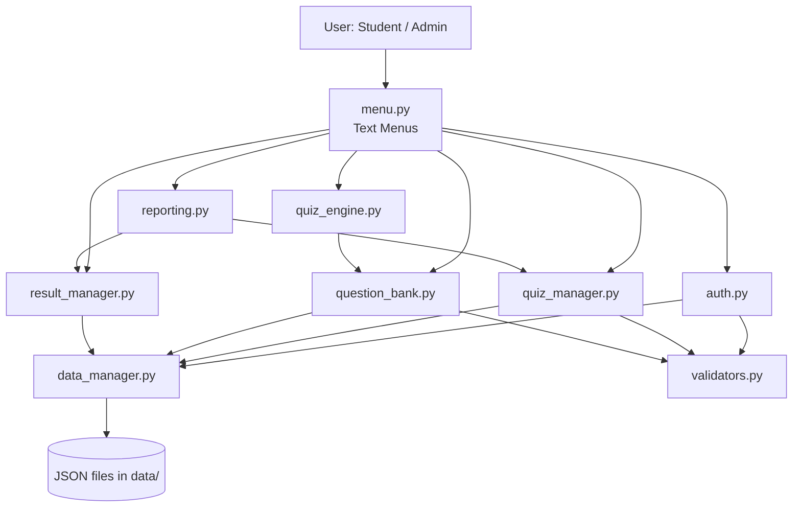

# System Architecture Diagram

Quizlix follows a simple layered / top-down design: the user interacts
only with the menu layer, which calls logic modules, which in turn go
through a single data-access layer to reach the JSON files.

**Why this shape?** Only `data_manager.py` touches the file system, so if
storage ever changed (e.g. to a real database) only one file would need
to change. `validators.py` is shared by every module that creates or
edits data, keeping validation rules consistent everywhere.
