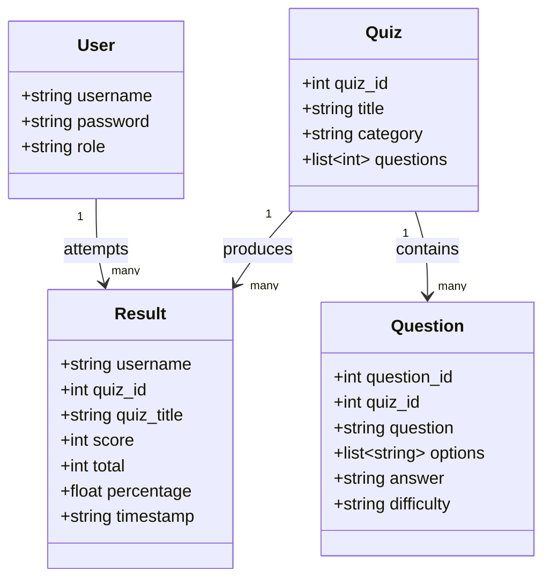

# Class / Component Diagram

Quizlix is written with plain functions and dictionaries rather than
custom classes (to match the beginner-level, function-based syllabus),
so this diagram shows the main **data records** (their fields) and which
**module** owns each one, which plays the same role a class diagram would
in an object-oriented design.

