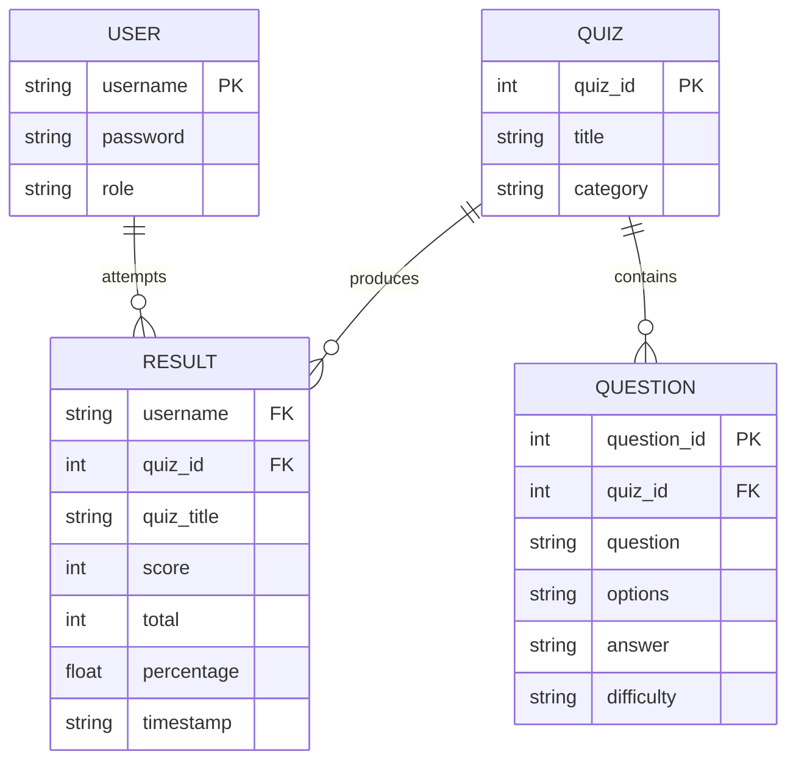

# ER Diagram / Data Design

Quizlix stores data as JSON files rather than SQL tables, but the same
relationships apply. Each JSON file below acts like one "table".

**Files:** `data/users.json` → USER, `data/quizzes.json` → QUIZ (with an
embedded list of question IDs), `data/questions.json` → QUESTION,
`data/results.json` → RESULT.
