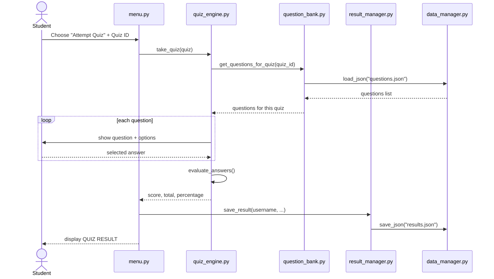

# Sequence Diagram — Student Attempts a Quiz

```mermaid
sequenceDiagram
    actor S as Student
    participant Menu as menu.py
    participant Engine as quiz_engine.py
    participant Bank as question_bank.py
    participant Result as result_manager.py
    participant Data as data_manager.py

    S->>Menu: Choose "Attempt Quiz" + Quiz ID
    Menu->>Engine: take_quiz(quiz)
    Engine->>Bank: get_questions_for_quiz(quiz_id)
    Bank->>Data: load_json("questions.json")
    Data-->>Bank: questions list
    Bank-->>Engine: questions for this quiz
    loop each question
        Engine->>S: show question + options
        S-->>Engine: selected answer
    end
    Engine->>Engine: evaluate_answers()
    Engine-->>Menu: score, total, percentage
    Menu->>Result: save_result(username, ...)
    Result->>Data: save_json("results.json")
    Menu-->>S: display QUIZ RESULT
```
