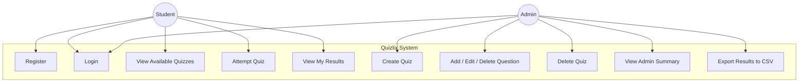

# Use Case Diagram

```mermaid
flowchart TB
    Student((Student))
    Admin((Admin))

    subgraph Quizlix System
        UC1[Register]
        UC2[Login]
        UC3[View Available Quizzes]
        UC4[Attempt Quiz]
        UC5[View My Results]
        UC6[Create Quiz]
        UC7[Add / Edit / Delete Question]
        UC8[Delete Quiz]
        UC9[View Admin Summary]
        UC10[Export Results to CSV]
    end

    Student --> UC1
    Student --> UC2
    Student --> UC3
    Student --> UC4
    Student --> UC5

    Admin --> UC2
    Admin --> UC6
    Admin --> UC7
    Admin --> UC8
    Admin --> UC9
    Admin --> UC10
```
