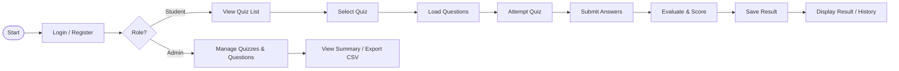

# Process Flow / Workflow Diagram

## Overall flow



## Student workflow

```
Login -> Student Menu -> View Quizzes -> Select Quiz ->
Answer Questions -> Submit -> Result -> History
```

## Admin workflow

```
Login -> Admin Menu -> Create/View/Delete Quiz ->
Manage Questions -> View Results Summary / Export CSV
```
